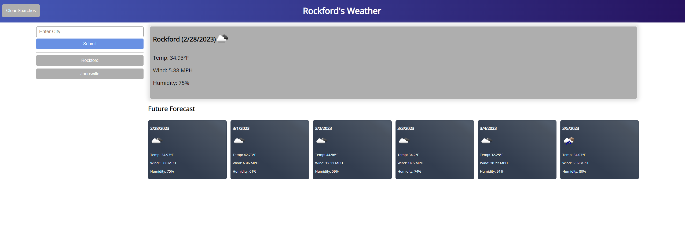

# Description
This project is a weather app where the user is able to enter a city name and find the desired city's 5 day forecast

# Specifications
This project uses openWeatherApi to gather data for the city that is given so that the user is able to see the forecast for the next 5 days. This uses local storage to save the users search history so they can come back and click on a city and get the data displayed. We are also saving the last searched city so that when the user comes back it comes back to the city that they were last looking at. In the upper left hand corner we also added a clear searches button so that if the history get too long the user is able to clear the searches and have a clean history. Clearing the searches only affects that area since the last searched city is saved to a different variable. We are also using async and await instead of fetch/.then due to this making the code look better and easier for others to read.

When we save the searches to local storage and then once the player hits submit the page will refresh and get rid of any duplicates in the savedSearches array using .filter, so that we don't have the same city multiple times on the page.

# Live Wesbite
## [Live URL](https://mjlynch123.github.io/WeatherApp/)
